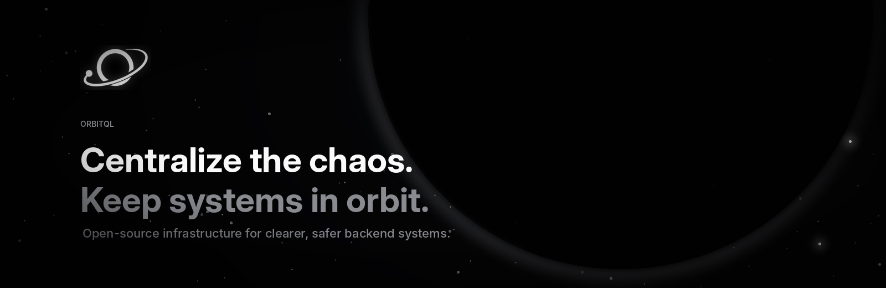

  

## Who We Are

**OrbitQL** is an independent team building open-source infrastructure for developers working with complex backend systems.

We believe critical software logic should not be scattered across services, handlers, and codebases. It should have a clear center: **explicit, consistent, and easier to control**.

Our team brings together two software engineers focused on backend architecture, databases, and APIs, and one product and business specialist focused on strategy, positioning, and community.

## Our Projects

### OrbitQL

Our first project explores a more centralized way to define and enforce the rules that govern application data and workflows.

  <a href="PROJECT_REPOSITORY_URL"><strong>Repository</strong></a>
  &nbsp;&nbsp;·&nbsp;&nbsp;
  <a href="DOCUMENTATION_URL"><strong>Documentation</strong></a>
  &nbsp;&nbsp;·&nbsp;&nbsp;
  <a href="DEMO_URL"><strong>Live Demo</strong></a>
  &nbsp;&nbsp;·&nbsp;&nbsp;
  <a href="ROADMAP_URL"><strong>Feedback & Roadmap</strong></a>

> OrbitQL is currently evolving. More repositories, examples, and developer resources will be added as the project grows.

## Links & Contacts

  <a href="https://github.com/OrbitQL-team"><strong>GitHub Organization</strong></a>
  &nbsp;&nbsp;·&nbsp;&nbsp;
  <a href="mailto:orbitql.team@gmail.com"><strong>Email</strong></a>

  Centralize the chaos. Keep systems in orbit.

